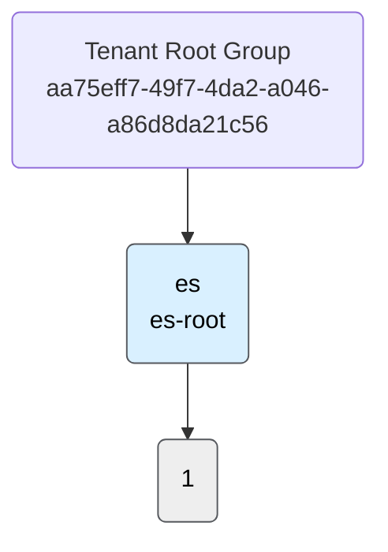

# Azure Governance Visualizer - Management Group Hierarchy

## HierarchyMap (Mermaid)

## Summary

Total Management Groups: 2 (depth 1)\
Total Subscriptions: 1\
Total Custom Policy definitions: 47\
Total Custom PolicySet definitions: 2\
Total Policy assignments: 1\
Total Policy assignments ManagementGroups 0\
Total Policy assignments Subscriptions 1\
Total Policy assignments ResourceGroups: 0\
Total Custom Role definitions: 0\
Total Role assignments: 22\
Total Role assignments (Tenant): 1\
Total Role assignments (ManagementGroups): 3\
Total Role assignments (Subscriptions): 9\
Total Role assignments (ResourceGroups and Resources): 9\
Total Blueprint definitions: 0\
Total Blueprint assignments: 0\
Total Resources: 16\
Total Resource Types: 11

## Hierarchy Table

| **MgLevel** | **MgName** | **MgId** | **MgParentName** | **MgParentId** | **SubName** | **SubId** |
|-------------|-------------|-------------|-------------|-------------|-------------|-------------|
| 1 | es | es-root | Tenant Root Group | aa75eff7-49f7-4da2-a046-a86d8da21c56 | Visual Studio Enterprise Subscription – MPN | d15e24d4-e2d6-426e-ad94-8789e6c09f7c |

